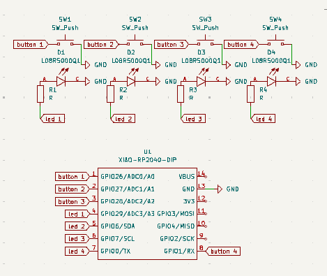
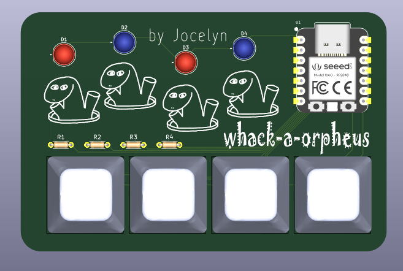
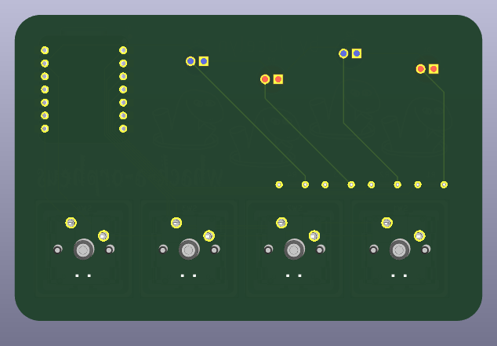

# Description:  
Project submission for Pathfinder Hack Club. 
This is a pcb replica of the classic arcade game whack-a-mole with a little twist. Player has to press all 4 buttons to start the game. Each light corresponds to the button below it. Whenever a light lights up, the person has to press on the button while the light is still on. The game is one minute long, but the game progressively gets harder every 15 seconds and the interval of each light lighting up is shortened. Before and at the end of game the light does a little dance (lights up in a pattern), to indicate that the game is starting/ending. After the game is over, the lights blink to show what score you get.  
How to see what score you got:  
Each light represents a digit of the number, and each blink is a +1 on that digit.   aka if your score is 64 then the rightmost light will blink 4 times and the second light counting from the right will blink 6 times.

# Images:  
Schematic diagram  

PCB front image  
  
PCB back image

# Bill of Materials:  
1 XIAO RP2040  
4 LEDs  
4 220 ohm resistors  
4 buttons